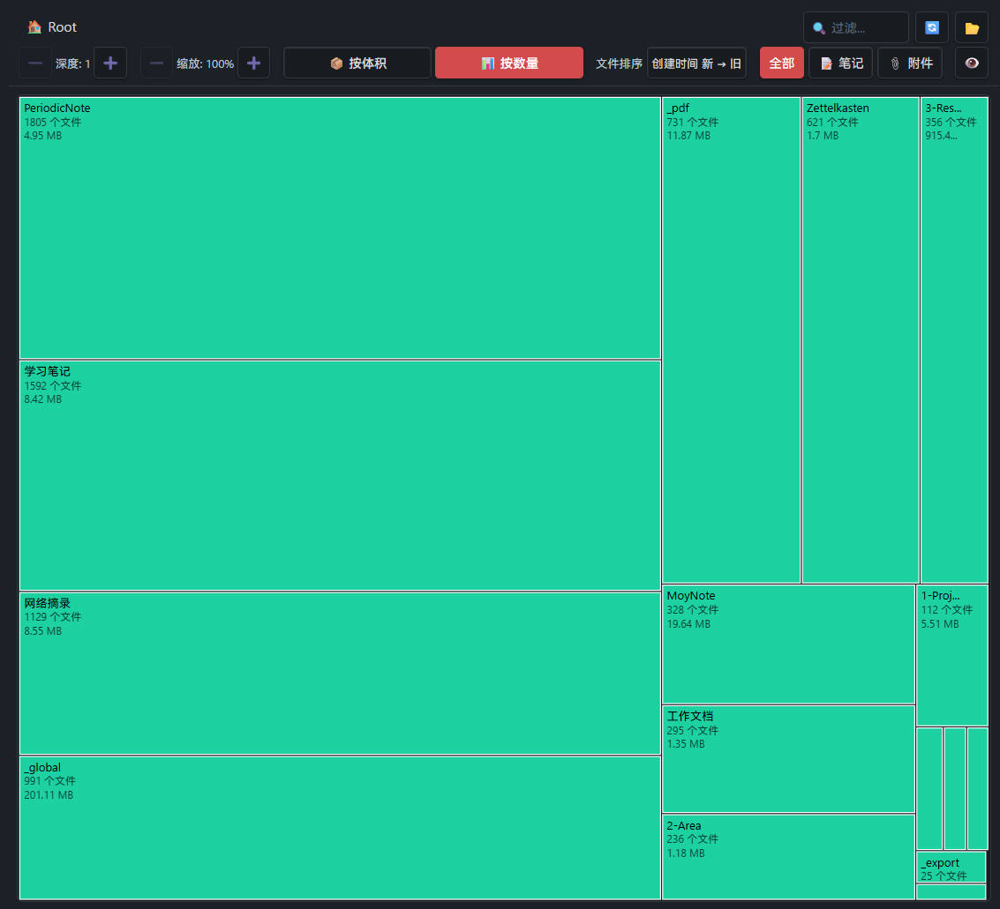

# Vault Sniffer

**[English](#english) | [中文](#中文)**

---

## English

Visualize your Obsidian vault's file distribution with an interactive treemap — inspired by SpaceSniffer and WizTree.

### Features

**Navigation**
- Interactive treemap, drill into folders by clicking
- Breadcrumb path navigation with one-click jump
- ⬆️ Up button to return to the parent folder
- "Go to folder" command for quick jumping

**Display modes**
- 📦 By size — rectangle area represents file size
- 📊 By count — rectangle area represents file count
- Zoom control (50% ~ 300%)
- Depth control to expand or collapse levels

**Filtering & sorting**
- 🔍 Real-time fuzzy search, multi-keyword (space-separated)
- Filter by content: All / 📝 Notes / 📎 Attachments
- 👁️ / 🙈 Files-only toggle — hide folders to focus on files
- Sort rules: name, created time, modified time, size

**Customization**
- Color-coded by file type (md / images / pdf / zip / others)
- Display frontmatter properties on rects and tooltips
- Show word count, file size, custom properties
- Date format configuration

**Settings**
- Ignore folders, file extensions, path patterns
- Hide hidden files (`.` prefix)
- Click-to-open with configurable target (tab / split / window)
- Default display mode

### Installation

Install via Obsidian Community Plugins (search "Vault Sniffer"), or manually:

1. Download `main.js`, `manifest.json`, `styles.css` from the [latest release](../../releases/latest)
2. Copy them to `.obsidian/plugins/vault-sniffer/`
3. Enable the plugin in Obsidian settings

### Usage

1. Click the `layout-grid` icon in the ribbon, or run **Analyze vault** from the command palette
2. Click any folder rectangle to drill in
3. Use the toolbar to filter, sort, and adjust the view

---

## 中文

以交互式矩形树图（Treemap）可视化展示 Obsidian Vault 中的文件分布，灵感来自 SpaceSniffer 和 WizTree。

### 功能特性

**导航**
- 交互式矩形树图，点击文件夹矩形可钻入
- 面包屑路径导航，点击任意层级快速跳转
- ⬆️ 向上按钮返回上级目录
- 「跳转文件夹」命令，快速定位任意层级

**显示模式**
- 📦 按体积 — 矩形面积代表文件大小
- 📊 按数量 — 矩形面积代表文件数量
- 缩放控制（50% ~ 300%）
- 深度控制，展开/折叠层级

**过滤与排序**
- 🔍 实时 fuzzy 搜索，支持空格分隔的多关键词
- 内容过滤：全部 / 📝 笔记 / 📎 附件
- 👁️ / 🙈 仅文件切换，隐藏文件夹聚焦文件
- 排序规则：名称、创建时间、修改时间、体积

**自定义**
- 按文件类型区分颜色（md / 图片 / pdf / zip / 其他）
- 在矩形和悬浮提示中显示 frontmatter 属性
- 支持字数统计、文件体积、自定义属性
- 日期属性格式化配置

**设置**
- 忽略文件夹、文件类型、路径关键词
- 忽略隐藏文件（`.` 开头）
- 点击打开文件，可配置打开位置（新标签页 / 分屏 / 新窗口）
- 默认显示模式

### 安装方式

通过 Obsidian 社区插件市场搜索「Vault Sniffer」安装，或手动安装：

1. 从 [最新 Release](../../releases/latest) 下载 `main.js`、`manifest.json`、`styles.css`
2. 复制到 `.obsidian/plugins/vault-sniffer/` 目录
3. 在 Obsidian 设置中启用插件

### 使用方法

1. 点击功能区的 `layout-grid` 图标，或在命令面板中执行**分析当前库**
2. 点击任意文件夹矩形钻入
3. 使用工具栏进行过滤、排序和视图调整

---

## License / 许可证

MIT
